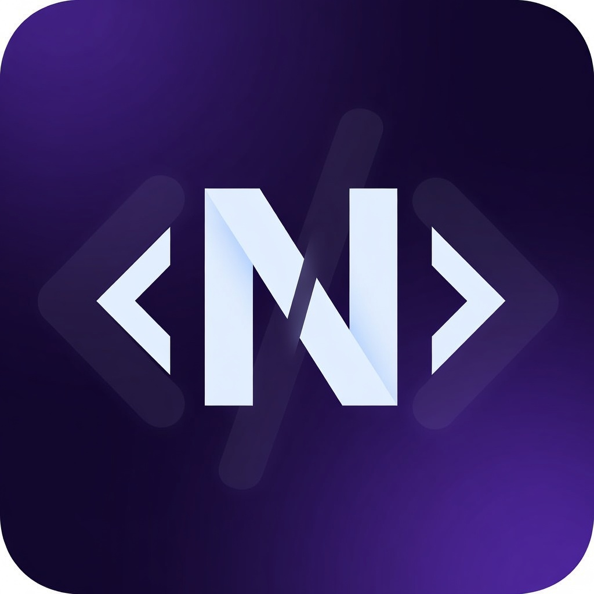
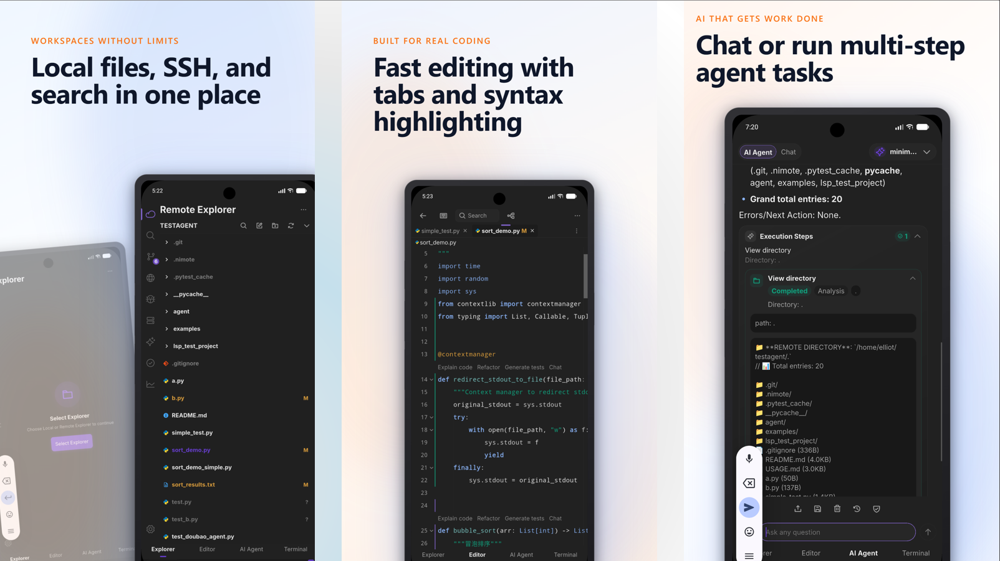

<p align="center">
  
</p>

<h1 align="center">NimoteCode</h1>

<p align="center"><strong>Mobile IDE for Real Development</strong></p>

<p align="center">Code anywhere. Ship anywhere.</p>

<p align="center">From an SSH connection or AI request to a verified Git change — without losing project context.</p>

<p align="center">SSH · AI Coding · Git · Terminal · Android Local Linux</p>

<p align="center">
  <a href="https://nimotecode.com"></a>
  <a href="https://play.google.com/store/apps/details?id=com.nimote.nimotecode"></a>
  <a href="https://apps.apple.com/app/nimotecode-ssh-client-ide/id6776158253"></a>
  <a href="https://nimotecode.com/docs/quick-start"></a>
</p>

<p align="center">
  
</p>

## Finish the whole development loop

Most mobile tools stop at a shell or a chat window. NimoteCode keeps the active project, Explorer, editor, terminal, Git review, preview, and AI assistance in one mobile workspace—so you can inspect, edit, run, review, and ship a real change.

Keep source code, credentials, toolchains, and long-running processes on the host where they belong; use your phone or tablet to make a focused change with the surrounding project context intact.

## Three ways to work

| Remote Development | Android Local Linux | AI Coding |
| --- | --- | --- |
| **SSH → Mac / Linux / VPS**<br>Turn a remote connection into a working project: explore, edit, run checks, and review the diff in place. | **Ubuntu + PRoot → ARM64 / x86_64**<br>Use a rootless local environment when you need tools on-device—not just remote access. | **Built-in AI Agent**<br>Keep AI beside the files, terminal output, and Git changes it needs; use Claude Code and Codex on your own host when preferred. |
| [Remote development guide](resources/remote-development-from-phone.md) · [SSH docs](https://nimotecode.com/docs/ssh) | [Local Linux docs](https://nimotecode.com/docs/local-linux) · [Workflow example](examples/android-local-linux/README.md) | [Mobile AI coding](resources/mobile-ai-coding.md) · [Claude Code](examples/claude-code-over-ssh/README.md) · [Codex](examples/codex-over-ssh/README.md) |

## Demo

<p align="center">
  <video src="https://github.com/user-attachments/assets/531d62fc-4874-41b9-96af-1ac9d2ad6fd6" controls muted playsinline width="420" poster="docs/public/videos/nimotecode-poster.jpg">
    Your browser does not support embedded video. Open the <a href="https://github.com/user-attachments/assets/531d62fc-4874-41b9-96af-1ac9d2ad6fd6">AI Agent demo video</a> instead.
  </video>
</p>

## What stays connected

| Project context | Development loop | AI with control |
| --- | --- | --- |
| Local projects<br>SSH workspaces<br>Android Local Linux | Explorer and editor<br>Terminal, tasks, Git, search<br>LSP, debug, preview | AI Chat and AI Agent<br>Provider configuration<br>Claude Code / Codex over SSH |

## Android Local Linux

Ubuntu development directly on supported Android devices, powered by PRoot without Android root.

**ARM64 · x86_64 · Ubuntu 24.04**

[Local Linux Docs](https://nimotecode.com/docs/local-linux) · [Linux Presets](https://github.com/mobiledevloperlab/nimote-linux-presets) · [Presets Overview](presets/README.md)

Linux Presets owns the technical manifests, installers, verification records, and release assets. See that repository for compatibility and installation details.

## Developer resources

- [Mobile Development](resources/mobile-development.md)
- [Android Linux Development](resources/android-linux-development.md)
- [Remote Development from Phone](resources/remote-development-from-phone.md)
- [Mobile AI Coding](resources/mobile-ai-coding.md)
- [Claude Code on Phone](resources/claude-code-on-phone.md)

More task-oriented setups are in [examples](examples/README.md); product documentation is at [nimotecode.com/docs](https://nimotecode.com/docs/quick-start).

## Interested in mobile development?

⭐ Star NimoteCode to follow the project and help more developers discover practical mobile-development workflows.

[](https://github.com/mobiledevloperlab/nimotecode)

## Community

[Discord](https://discord.gg/tTxbpqYmhR) · [GitHub Issues](https://github.com/mobiledevloperlab/nimote_issues/issues) · [X](https://x.com/mobiledevlab)

## Development

This repository contains the public website, documentation, and developer resources; the application source is not published here. For site development:

```bash
npm ci
npm run docs:build
npm run docs:check
```

Use `npm run docs:dev` for a local preview. For Linux Preset changes, follow the contribution guidance in the [Linux Presets repository](https://github.com/mobiledevloperlab/nimote-linux-presets).

## License

Unless a file states otherwise, this repository contains NimoteCode website and documentation material. Android Local Linux corresponding source and third-party notices are published under [Local Linux Source and Licenses](https://nimotecode.com/docs/local-linux-source). Linux Presets has its own [MIT license](https://github.com/mobiledevloperlab/nimote-linux-presets/blob/master/LICENSE).
