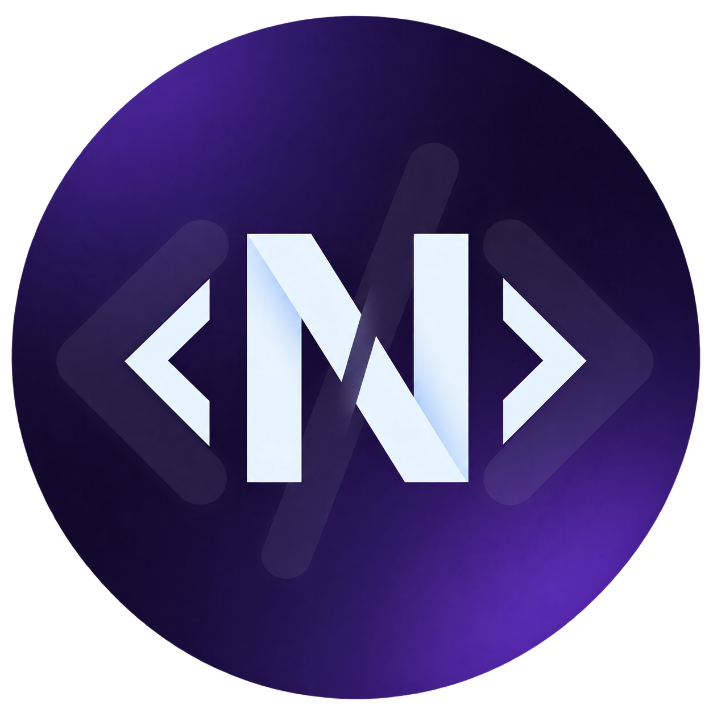
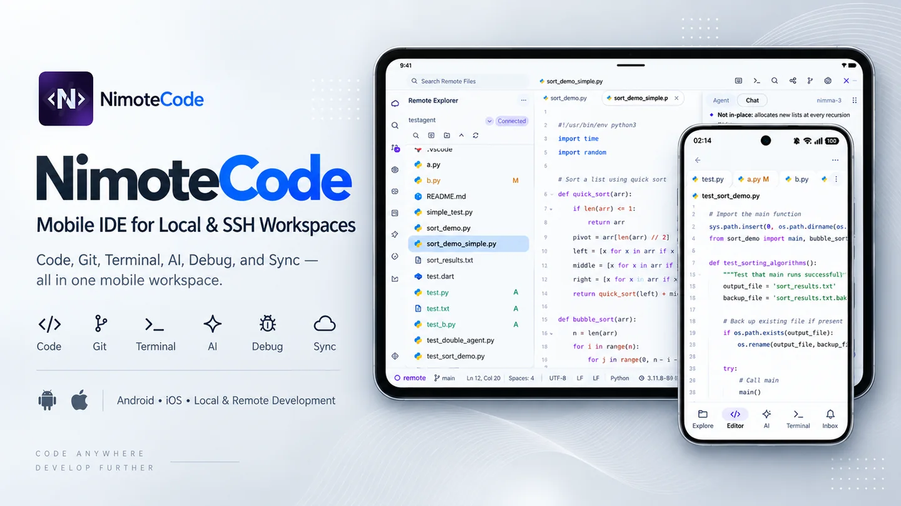

<p align="center">
  
</p>

<h1 align="center">NimoteCode</h1>

<p align="center"><a href="README.zh-CN.md">简体中文</a> · English</p>

<p align="center">Mobile IDE for Real Development<br>Your project, terminal, Git, debugger and AI agents — in one mobile workspace.</p>

<p align="center"><b>Early Access Pro — Free with sign-in</b><br>Sign in to unlock Pro features during Early Access.</p>

<p align="center">
  <a href="https://play.google.com/store/apps/details?id=com.nimote.nimotecode"></a>
  <a href="https://apps.apple.com/app/nimotecode-ssh-client-ide/id6776158253"></a>
  <a href="https://nimotecode.com"></a>
  <a href="https://nimotecode.com/docs/quick-start"></a>
</p>

<p align="center">
  
</p>

## One workspace. The whole development loop.

**Explore → Edit → Run → AI → Debug → Review → Ship**

Pick a workspace, make the edit, run the check, review the diff, and ship when the change is ready — without leaving the app.

## Demo

> [!TIP]
> **NimoteCode is actively developed and shaped by developer feedback.** Share ideas, questions, or bugs in [GitHub Issues](https://github.com/mobiledevloperlab/nimote_issues/issues); we read and reply to every report.

<div align="center" style="padding: 24px 16px; background: radial-gradient(ellipse at center, rgba(56, 139, 253, 0.16) 0%, rgba(56, 139, 253, 0) 72%);">
  <video src="https://github.com/user-attachments/assets/531d62fc-4874-41b9-96af-1ac9d2ad6fd6" controls muted playsinline width="420" poster="docs/public/videos/nimotecode-poster.jpg" style="display: block; max-width: 100%; margin: 0 auto; border: 1px solid rgba(56, 139, 253, 0.28); border-radius: 16px; box-shadow: 0 12px 32px rgba(27, 31, 35, 0.18);">
    Open the <a href="https://github.com/user-attachments/assets/531d62fc-4874-41b9-96af-1ac9d2ad6fd6">AI Agent demo video</a>.
  </video>
</div>

## Why NimoteCode?

**More than a remote terminal.**

| Capability | SSH Client | AI Agent Terminal | NimoteCode |
| --- | :---: | :---: | :---: |
| Remote SSH | ✅ | ✅ | ✅ |
| Code Editor | — | — | ✅ |
| Git Workflow | — | — | ✅ |
| AI Agent | — | ✅ | ✅ |
| Android Local Linux | — | — | ✅ |
| LSP / Diagnostics | — | — | ✅ |
| Debugging | — | — | ✅ |
| Web Preview | — | — | ✅ |

This compares typical setups; what you get depends on the tools you already use.

## Three ways to develop

| Way | Use it when | What you get |
| --- | --- | --- |
| **Remote SSH** | The project lives on your Mac, Linux host, or VPS. | You work against the real host and keep heavy toolchains and services there. |
| **Android Local Linux** | You want Linux tools on the device itself. | Root-free Ubuntu through PRoot on supported ARM64 and x86_64 Android devices. |
| **Local Workspace** | Your files are already on the phone or tablet. | Fast editing with the same editor, terminal, Git, and AI workflow. |

Switch between them without changing how you browse, edit, run, or review a project.

## AI, your way

| Option | How it works |
| --- | --- |
| **Built-in Agent** | A project-aware assistant with file, terminal, and Git context. |
| **ACP Agent** | Connect a compatible external agent in an SSH workspace and follow permissions and progress in one timeline. |
| **Claude Code / Codex** | Run them on your own host and work with them through the terminal. |

## Core capabilities

| Area | What you can do |
| --- | --- |
| Explorer and Search | Browse and search a project. |
| Editor | Edit files with LSP diagnostics for supported languages. |
| Terminal | Run commands and tasks locally, on Android Local Linux, or on a remote host. |
| Tasks | Run and review project tasks. |
| Source Control | Check Git status and diffs, then commit, pull, and push. |
| Debugger | Step through code with the debugger. |
| Preview | Preview web output, including HTML snapshots. |
| AI | Use the built-in agent, an ACP agent, or Claude Code / Codex on your own host. |

## Try NimoteCode

NimoteCode is currently in Early Access.

Sign in to unlock Early Access Pro and try the full development workflow at no additional cost during the Early Access period.

<p>
  <a href="https://play.google.com/store/apps/details?id=com.nimote.nimotecode"></a>
  <a href="https://apps.apple.com/app/nimotecode-ssh-client-ide/id6776158253"></a>
</p>

## Mobile Development Guides

Technical notes for developing away from a desk, covering local, remote, Android Linux, Git, and AI workflows.

- [Mobile development resources](resources/README.md) — the full guide index
- [Workflow examples](examples/README.md) — SSH, Codex, Claude Code, and Android Local Linux setups
- [NimoteCode documentation](https://nimotecode.com/docs/quick-start) — setup and feature reference

## Linux Presets

Optional Android Local Linux environments, with versioned manifests and verification scripts, live in a separate repository.

[Linux Presets](https://github.com/mobiledevloperlab/nimote-linux-presets) · [Preset overview](presets/README.md) · [Android Local Linux docs](https://nimotecode.com/docs/local-linux)

## What's New

Recent releases add first-launch onboarding, Android Local Linux, HTML snapshot preview, external ACP agents, and flexible workspace directories, plus reliability fixes for SSH credentials, Tasks, Source Control and Diff, Git refresh, Terminal, AI, and Local Linux. Version 1.1.8 also begins **Early Access Pro**.

Store builds are the current release, and the GitHub Release package can be an older build.

🗒️ [Read the release notes](https://github.com/mobiledevloperlab/nimotecode/releases)

## Community

Questions, bugs, and ideas are welcome — every report gets read.

💬 [Discord](https://discord.gg/tTxbpqYmhR) · [GitHub Issues](https://github.com/mobiledevloperlab/nimote_issues/issues) · [X](https://x.com/mobiledevlab)

⭐ Star the repository to follow NimoteCode and new mobile development resources.

[](https://github.com/mobiledevloperlab/nimotecode)

## About this repository

NimoteCode is a commercial, closed-source application. This public repository is the official home for:

- Product documentation
- Mobile development guides
- Workflow examples
- Android Linux presets
- Release notes
- Community issues and feedback

The NimoteCode application source code is not published in this repository.

Build the website and docs locally:

```bash
npm ci
npm run docs:build
npm run docs:check
```

Use `npm run docs:dev` to preview locally.

## License

Website and docs unless stated otherwise. [Local Linux source and licenses](https://nimotecode.com/docs/local-linux-source) · Linux Presets: [MIT](https://github.com/mobiledevloperlab/nimote-linux-presets/blob/master/LICENSE).
