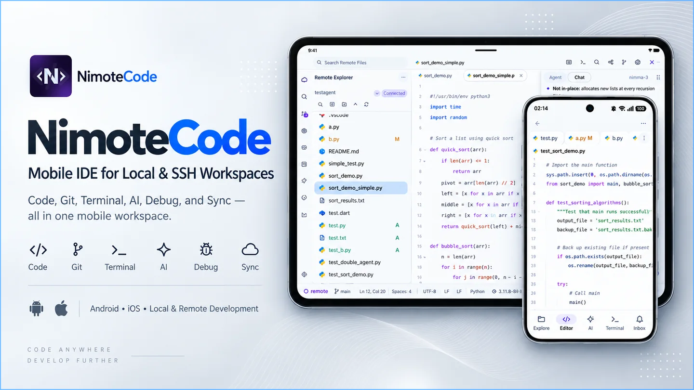

<p align="center">
  
</p>

<h1 align="center">NimoteCode</h1>

<p align="center">简体中文 · <a href="README.md">English</a></p>

<p align="center">项目、终端、Git、调试器与 AI Agent ——<br>都在同一移动工作区。</p>

<p align="center">
  <a href="https://nimotecode.com/zh/"></a>
  <a href="https://play.google.com/store/apps/details?id=com.nimote.nimotecode"></a>
  <a href="https://apps.apple.com/app/nimotecode-ssh-client-ide/id6776158253"></a>
  <a href="https://nimotecode.com/zh/docs/quick-start"></a>
</p>

> [!IMPORTANT]
> **请从商店安装。** GitHub Release 附带的是较早构建；请通过 [Google Play](https://play.google.com/store/apps/details?id=com.nimote.nimotecode) 或 [App Store](https://apps.apple.com/app/nimotecode-ssh-client-ide/id6776158253) 获取 NimoteCode。
>
> **1.1.6–1.1.8 重点更新：**新增首次启动引导、Android 本地 Linux、HTML 快照预览、外部 ACP Agent 和灵活的工作区目录切换；并提升 SSH 凭据、Tasks、Source Control 与 Diff、Git 刷新、终端、AI 和 Local Linux 的可靠性。1.1.8 同时开启 **Early Access Pro**。[查看发布说明](https://github.com/mobiledevloperlab/nimotecode/releases)。

<p align="center">
  
</p>

## 一个工作区。完整开发闭环。

**探索 → 编辑 → 运行 → AI → 调试 → 审查 → 交付**

Explorer、编辑器、搜索、终端、任务、诊断、调试器、Git、预览与 AI，都在一个工作区中。

## 演示

> [!TIP]
> **持续迭代，开放共建。**我们的目标是打造移动端最强的 IDE。欢迎通过 [GitHub Issues](https://github.com/mobiledevloperlab/nimote_issues/issues) 提交建议、问题或 Bug；我们会阅读并回复每一条反馈。

<div align="center" style="padding: 24px 16px; background: radial-gradient(ellipse at center, rgba(56, 139, 253, 0.16) 0%, rgba(56, 139, 253, 0) 72%);">
  <video src="https://github.com/user-attachments/assets/531d62fc-4874-41b9-96af-1ac9d2ad6fd6" controls muted playsinline width="420" poster="docs/public/videos/nimotecode-poster.jpg" style="display: block; max-width: 100%; margin: 0 auto; border: 1px solid rgba(56, 139, 253, 0.28); border-radius: 16px; box-shadow: 0 12px 32px rgba(27, 31, 35, 0.18);">
    打开 <a href="https://github.com/user-attachments/assets/531d62fc-4874-41b9-96af-1ac9d2ad6fd6">AI Agent 演示视频</a>。
  </video>
</div>

## 从项目到完成一次改动

NimoteCode 将移动端的关键开发闭环放在一起：选择工作区、完成编辑、运行验证、审查 diff，并在改动就绪时交付。

| 从这里开始 | 接着做什么 | 如何完成 |
| --- | --- | --- |
| 打开本地目录、Android 本地 Linux 或 SSH 项目 | 在编辑器中修改，通过终端或 Tasks 完成验证 | 提交或推送前审查 Git 状态和 Diff |
| 搜索项目，或让 AI 协助处理聚焦任务 | 检查产生的文件变更与命令输出 | 让决策和交付步骤始终清晰可见 |

## 为项目选择合适的工作区

| 项目所在位置或需求 | 选择 | 你将获得 |
| --- | --- | --- |
| 文件已在手机或平板上 | **本地工作区** | 快速编辑，并使用同一套编辑器、终端、Git 与 AI 工作流 |
| 需要在 Android 上使用 Linux 工具 | **Android 本地 Linux** | 在支持 ARM64 与 x86_64 的 Android 设备上，通过 PRoot 使用免 root 的 Ubuntu |
| 项目位于 Mac、Linux 主机或 VPS | **远程 SSH** | 直接操作真实主机，同时将重型工具链与服务保留在主机上 |

无论切换到哪种工作区，浏览、编辑、运行与审查项目的方式始终一致。

## 选择 AI 工作流

| 你的需求 | 选择 | 最适合 |
| --- | --- | --- |
| 一体化、理解项目上下文的助手 | **内置 Agent** | 在文件、终端与 Git 上下文中完成聚焦任务 |
| 在 SSH 工作区使用兼容的外部 Agent | **ACP Agent** | 在统一的移动时间线中审查权限与进度 |
| 在自己的主机上使用 Claude Code 或 Codex | **CLI Agent** | 将 Agent 与认证留在远程主机，通过终端访问 |

希望最快上手时，先使用内置 Agent；已有兼容外部运行时可选择 ACP；现有工作流已经在远程主机中运行时，使用 CLI Agent。

## 需要时再深入

Android 本地 Linux 通过 PRoot 运行 Ubuntu 24.04，无需 Android root。需要配置或继续学习时，可查看[本地 Linux 文档](https://nimotecode.com/zh/docs/local-linux)、[Linux Presets](https://github.com/mobiledevloperlab/nimote-linux-presets)、[移动工作流指南](resources/mobile-coding-workflows.md)、[示例](examples/README.md)和[文档](https://nimotecode.com/zh/docs/quick-start)。

🗒️ [产品更新说明](https://github.com/mobiledevloperlab/nimotecode/releases)

## 关注移动开发的未来

NimoteCode 探索完整移动 IDE 工作流、Android Linux、远程开发与移动端 AI 编程。

⭐ Star 项目，关注它的进展。

[](https://github.com/mobiledevloperlab/nimotecode)

## 社区

💬 [Discord](https://discord.gg/tTxbpqYmhR) · [GitHub Issues](https://github.com/mobiledevloperlab/nimote_issues/issues) · [X](https://x.com/mobiledevlab)

## 开发

NimoteCode 应用源码不在此仓库发布。本仓库包含官方网站、文档、开发者资源、工作流示例和产品更新说明。可按以下方式构建网站与文档：

```bash
npm ci
npm run docs:build
npm run docs:check
```

使用 `npm run docs:dev` 在本地预览。

## 许可证

除非另有声明，内容为网站与文档。 [本地 Linux 源码与许可证](https://nimotecode.com/zh/docs/local-linux-source) · Linux Presets：[MIT](https://github.com/mobiledevloperlab/nimote-linux-presets/blob/master/LICENSE)。
